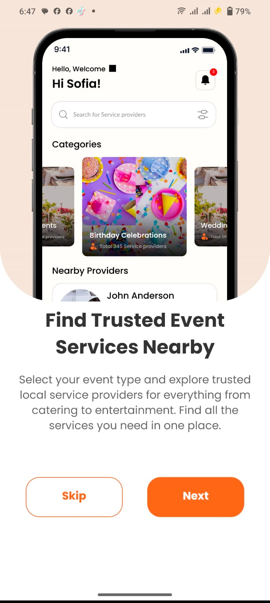
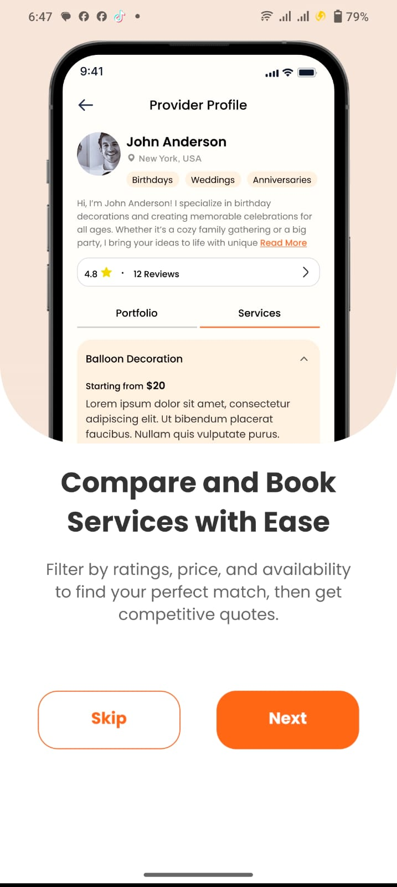
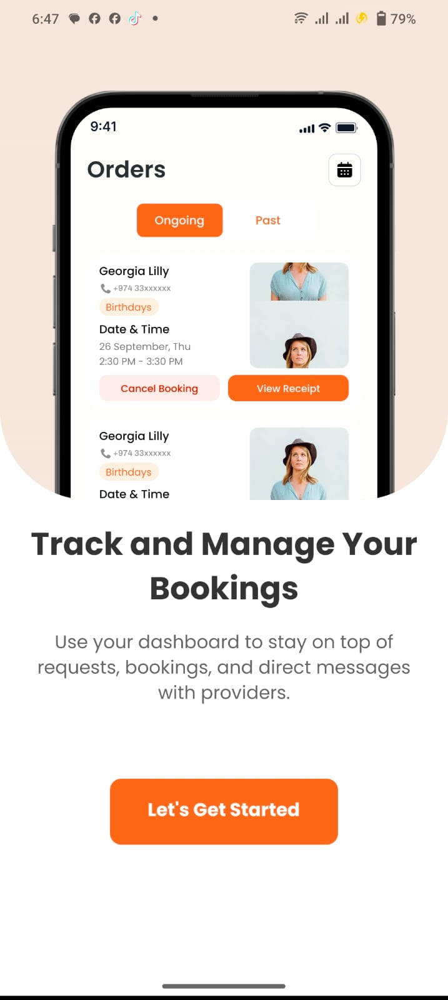
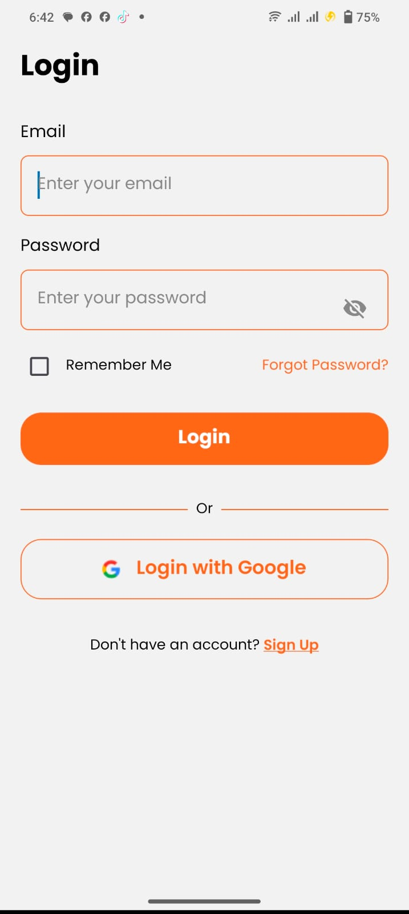
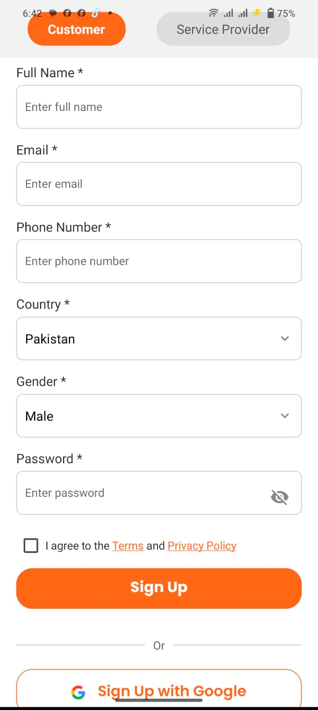
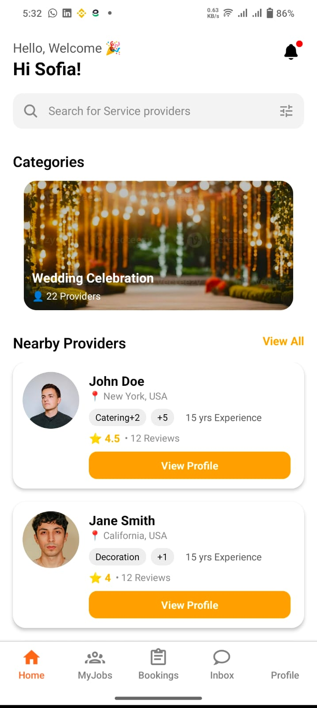
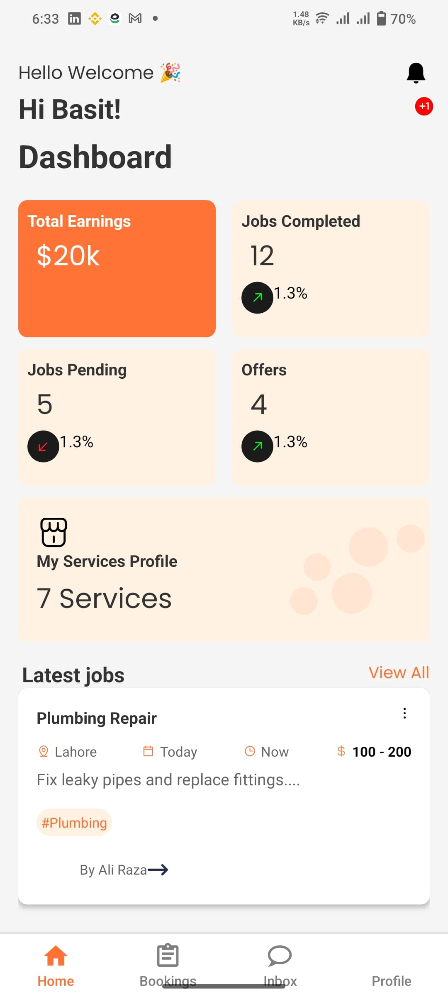
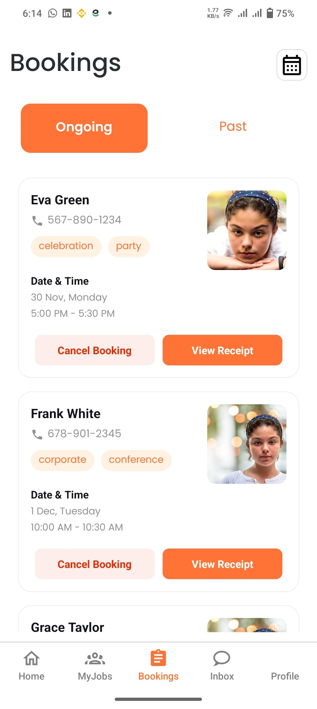
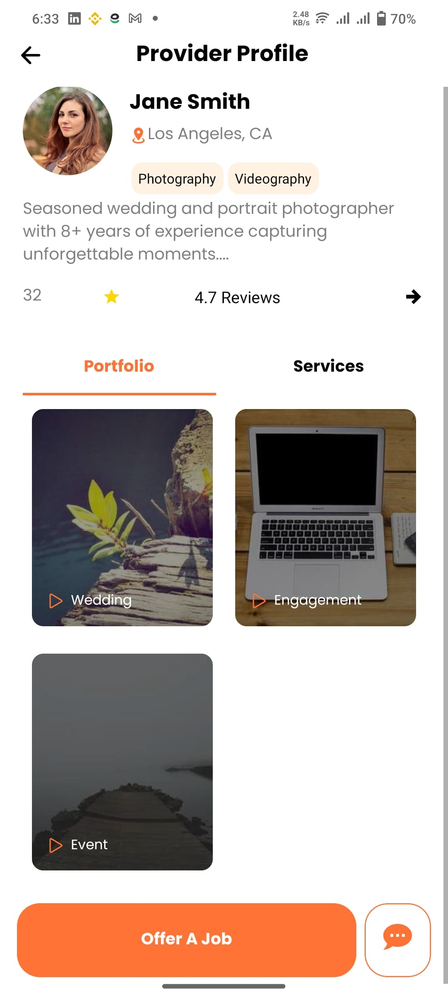
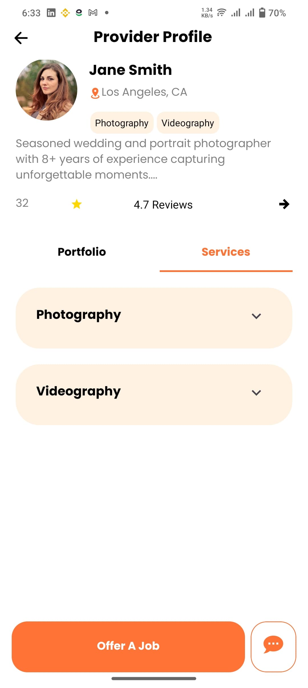

# 🎉 EMS (Event Management System) - Mobile UI App

A beautiful React Native application for event management with booking functionality, customer profiles, and service provider management.
<!-- 




  <!-- Add your screenshot here -->
<!--  --> -->
## ✨ Features

- **Booking Management**: View ongoing and past bookings
- **User Profiles**: Customer and service provider profiles
- **Category Filtering**: Filter by event categories (weddings, birthdays, etc.)
- **Responsive Design**: Works on both iOS and Android
- **Modern UI**: Clean, intuitive interface with smooth animations

## 📱 Screenshots

| Booking Screen | Profile Screen | Services |
  |  |  |  |  |  | 
|--------------|--------------|--------------|
|  |  |  |

## 🛠️ Installation

1. **Clone the repository**
   ```bash
   git clone https://github.com/HafizBasit7/EMS-ui-app.git
   cd EMS-ui-app